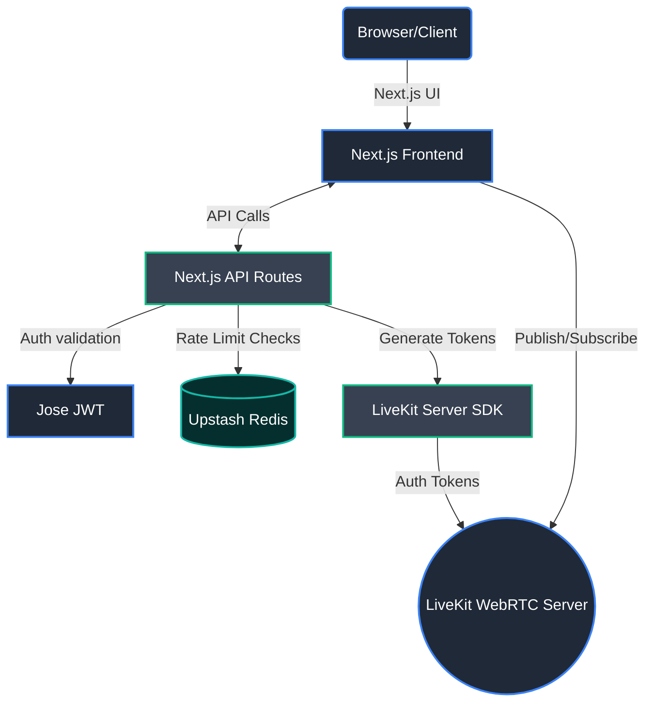
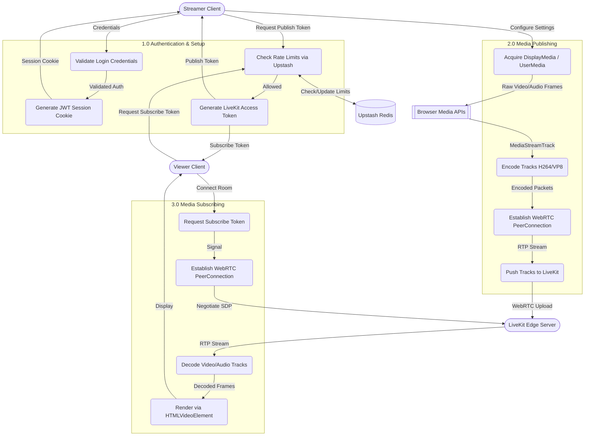

# WebRTC Real-Time Streaming Platform

This project is a high-performance, real-time web streaming platform built with **Next.js**, **LiveKit (WebRTC)**, and **Upstash Redis**. It allows users to broadcast their screen and audio with ultra-low latency (sub-500ms) to an audience directly from the browser.

---

## 🏗 Architecture Overview

The application follows a modern serverless architecture utilizing Next.js App Router for both the frontend UI and backend API routes.

### Tech Stack
*   **Framework:** Next.js 15 (React 19, App Router)
*   **WebRTC / Streaming:** LiveKit (`livekit-client`, `@livekit/components-react`, `livekit-server-sdk`)
*   **Authentication:** Custom JWT authentication using `jose`
*   **Rate Limiting / Caching:** Upstash Redis (`@upstash/redis`)
*   **Styling:** Custom CSS + Lucide React (Icons)
*   **Language:** TypeScript

### High-Level Architecture Diagram



---

## 🔄 Data Flow & Workflow

### Level 3 Data Flow Diagram (DFD)
This detailed DFD breaks down the precise data exchanges occurring during authentication, stream publishing, and stream consumption.



### 1. Authentication Flow
1.  A user accesses the `/login` route.
2.  Upon successful validation via the Next.js API route (`/api/auth`), a secure **JWT (JSON Web Token)** is generated using the `jose` library.
3.  The JWT is stored securely in an HTTP-only cookie to maintain the session.

### 2. Streamer Workflow (Broadcasting)
1.  The authenticated streamer visits the **Stream Control Center** (`StreamerDashboard.tsx`).
2.  The application requests a **LiveKit Access Token** from the Next.js backend (`livekit-server-sdk`), granting the user permission to *publish* tracks to a specific Room.
3.  The streamer selects their broadcast settings:
    *   **Mode:** Screen Only, Voice Only, or Both.
    *   **Resolution & Framerate:** Configurable from 144p to 1440p, optimized to capture at up to **120fps** for incredibly fluid gameplay or desktop sharing.
4.  The browser's `getDisplayMedia` and `getUserMedia` APIs capture the screen and microphone.
5.  LiveKit's WebRTC engine encodes the stream locally (e.g., VP8/H.264) and pushes it to the LiveKit Cloud/Server.

### 3. Viewer Workflow (Consuming)
1.  A viewer accesses the stream page (`StreamPlayer.tsx`).
2.  The backend generates a **LiveKit Access Token** with *subscribe-only* permissions.
3.  The player connects to the LiveKit Room via WebRTC.
4.  Video and Audio tracks are pulled from the LiveKit edge servers closest to the viewer, ensuring sub-second real-time latency worldwide.

### 4. Security & Rate Limiting
*   API routes are protected against abuse (e.g., spamming token generation) using **Upstash Redis** (`ratelimit.ts`).
*   This ensures the application remains stable and prevents unexpected billing spikes on serverless functions or LiveKit.

---

## 📁 Directory Structure

```text
d:\VAL\stream\web\
├── src/
│   ├── app/                # Next.js App Router (Pages & API Routes)
│   │   ├── api/            # Backend endpoints (LiveKit tokens, Auth, etc.)
│   │   ├── login/          # Authentication page
│   │   ├── page.tsx        # Main entry point / viewing page
│   │   └── layout.tsx      # Global layout
│   ├── components/         # Reusable React UI Components
│   │   ├── StreamerDashboard.tsx # Broadcaster UI & WebRTC Publishing logic
│   │   ├── StreamPlayer.tsx      # Viewer UI & WebRTC Subscribing logic
│   │   └── ...
│   └── lib/                # Utility functions and shared logic
│       ├── jwt.ts          # JSON Web Token creation & validation
│       └── ratelimit.ts    # Upstash Redis rate limiting logic
├── package.json            # Dependencies and scripts
└── next.config.ts          # Next.js configuration
```

---

## 🚀 Getting Started

### Prerequisites
*   Node.js v20+
*   A LiveKit account / self-hosted LiveKit Server (API Key, API Secret, URL)
*   An Upstash Redis database (URL, Token)

### Environment Variables
Create a `.env.local` file in the `web/` directory with the following keys:
```env
# LiveKit
NEXT_PUBLIC_LIVEKIT_URL=wss://your-project.livekit.cloud
LIVEKIT_API_KEY=your_api_key
LIVEKIT_API_SECRET=your_api_secret

# Upstash Redis (Rate Limiting)
UPSTASH_REDIS_REST_URL=https://your-database.upstash.io
UPSTASH_REDIS_REST_TOKEN=your_token

# JWT Secret
JWT_SECRET=your_super_secret_string
```

### Installation & Running Locally

1.  Navigate to the web directory:
    ```bash
    cd web
    ```
2.  Install dependencies:
    ```bash
    npm install
    ```
3.  Start the development server:
    ```bash
    npm run dev
    ```
4.  Open `http://localhost:3000` in your browser.

## ⚡ Performance Optimizations Implemented
*   **Dynamic Framerate/Bitrate Adjustment:** Custom encoding presets ensure that streams maintain high framerates (up to 120fps) without exceeding standard bandwidth limits (e.g., 6 Mbps for 1080p).
*   **Edge Delivery:** WebRTC tracks are routed via LiveKit's global edge network, preventing server bottlenecking on the Next.js host.
